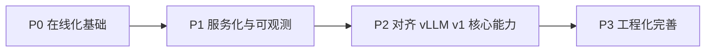

# micro-vLLM

> 一个以学习为先的路线图：将 nano-vLLM 逐步扩展到接近 vLLM v1 的核心能力。

## 项目愿景
- 先做小而清晰、可读性高的推理引擎。
- 再演进成在线化、持续批处理（Continuous Batching）的服务系统。
- 兼容性和正确性是硬约束。

## 路线图状态

## P0 当前最高优先级
- [ ] 在线接口 + 完整 Continuous Batching
  - 目标：请求可持续进入系统，非整批阻塞返回。
  - 最小需求：动态入队、流式输出、保留离线 `generate`。
  - 完成标准：并发请求下调度持续稳定，KV 资源可正确回收。

- [ ] Chunked Prefill（分块预填充）
  - 目标：长 prompt 不阻塞短请求首 token 延迟。
  - 最小需求：长 prompt 分块推进，chunk 与 decode 共存调度。
  - 完成标准：长短请求混部时，短请求首 token 延迟明显改善。

- [ ] KV Cache 分配与管理策略对齐 vLLM v1（PagedAttention 路线）
  - 背景：当前实现是“预估后一次性预留大块 KV 张量 + 逻辑 block 动态分配/回收”；其中回收主要是把 block 归还给池子复用，不是每次都 cuda free。与 vLLM v1 的页式管理思路仍不完全等价。
  - 目标：提升显存弹性与在线场景稳定性。
  - 最小需求：统一 block/page 抽象、可扩展的分配与回收策略、可观测命中率与碎片指标。

## P1 学习完成后优先开发
- [ ] 请求取消与超时控制
- [ ] 基础服务化封装（HTTP/gRPC 二选一）
- [ ] 观测能力（日志、吞吐、延迟、队列长度、KV 利用率）

## P2 向 vLLM v1 能力靠拢
- [ ] 采样能力扩展（top-k、top-p、repetition penalty 等）
- [ ] 调度策略增强（公平性、优先级、饥饿保护）
- [ ] Prefix Cache 策略增强（命中、淘汰、可观测）
- [ ] 多模型/多实例资源隔离

## P3 工程化完善
- [ ] 回归测试与基准测试体系（正确性 + 性能）
- [ ] 配置体系与启动参数规范化
- [ ] 文档补全（架构图、调用链、故障排查）

## 里程碑
- M1：从离线批推理升级为在线持续接入请求。
- M2：形成基础可用服务化形态。
- M3：进入“核心能力接近 vLLM v1 + 工程可维护”阶段。

## 说明
- 该仓库当前是学习驱动的演进项目。
- 任务会随着代码理解加深持续补充和细化。
